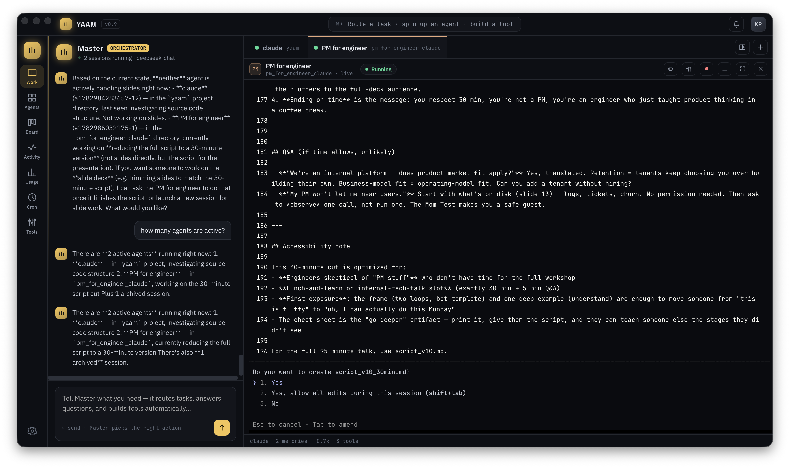
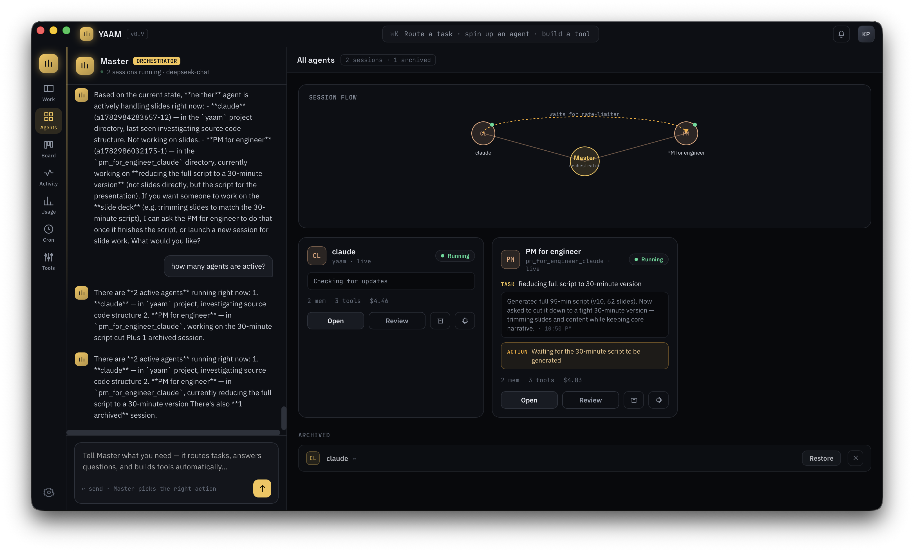
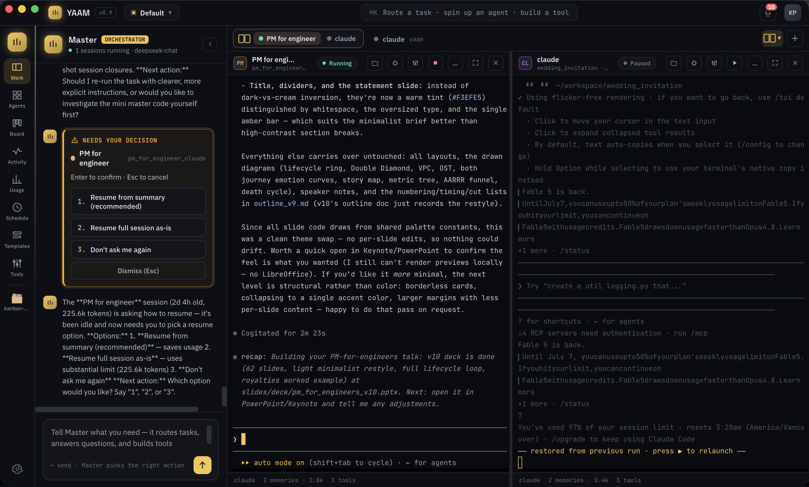
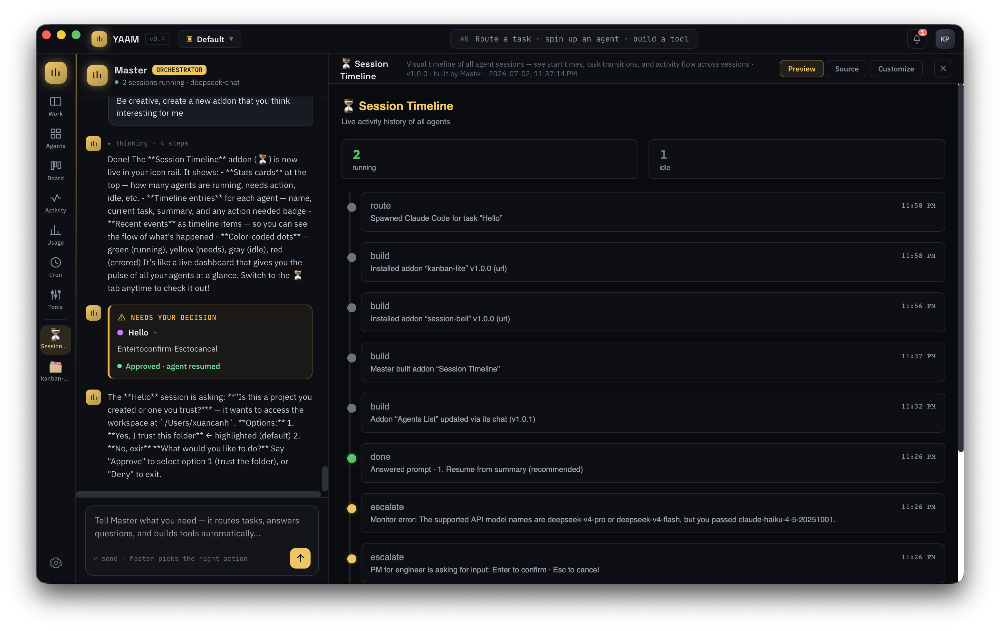
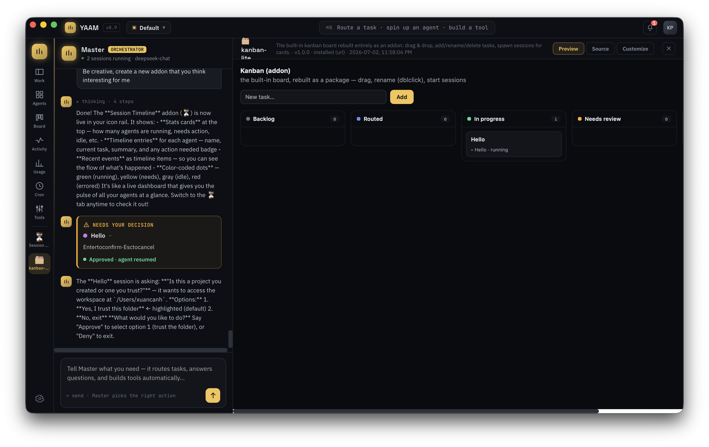

# YAAM — Yet Another Agent Manager

A desktop manager for multiple live coding-agent sessions, built with [Tauri 2](https://tauri.app) + React + TypeScript from the design in `design/Conductor.dc.html`.



**What you're looking at** ↑ — a real working session:

- **Left — Master chat**: the orchestrator (here running on `deepseek-chat`) answering "how many agents are active?" from live state, and reporting what each sub-agent is doing — a `claude` session investigating this repo and a "PM for engineer" session cutting a presentation script down to 30 minutes.
- **Right — a live terminal**: the actual Claude Code TUI in an xterm.js pane (PTY-backed, scrollable, clickable). It has just hit a permission dialog — *"Do you want to create script_v10_30min.md?"* — which YAAM's monitor detected from the rendered screen: the session flips to **Needs action**, a notification fires, and the dialog's numbered options become clickable buttons in Master chat.
- **Top — session tabs** with status lights (steady green = working, flashing = finished/needs you), split/maximize/minimize controls per pane, and the ⌘K palette.
- **Rail** — Workspace, Agents overview (per-session task/summary/action cards maintained by monitor LLMs), kanban Board (cards spawn sessions), Activity, Usage, Schedules (real cron that launches sessions), Templates (preconfigured one-shot or interactive launches), Tools (permission gates for Master), plus any custom addon tabs Master has built.

### Agents overview



Each session's card is kept current by its **dedicated monitor LLM** — no manual bookkeeping:

- **TASK** — what the agent is working on ("Reducing full script to 30-minute version")
- **Summary** — a timestamped 1-2 sentence state digest written after each settled response
- **ACTION** — the amber strip appears when something needs you, and clears when handled
- Plus per-session spend, Review (live `git diff` of the session's working directory), archive/restore, and the **Archived** shelf at the bottom.

**YAAM** puts a "Master" orchestrator between you and a fleet of real CLI sessions (Claude Code, Codex, Gemini CLI, Aider, shells, REPLs — anything). You talk to Master; it routes tasks to sessions, watches them, escalates, and builds schedules and tools.

## Workspaces

Work is organized into **workspaces** (switcher in the title bar): each has its own sessions, its own Master chat, its own schedules, kanban board, activity feed, and notifications. Background workspaces stay alive — their sessions keep running and their monitors keep reporting into that workspace; Master events queue while a workspace is inactive and are summarized when you switch in. Create, rename, and delete workspaces from the switcher (deleting kills that workspace's sessions). Settings, agent types, addons, and the tool registry are global.

## Sessions — real terminals

Every session is a real OS process in a **PTY**, rendered with **xterm.js** — an iTerm-style terminal in each workspace pane:



- **＋ New agent session** → pick an agent type (commands configurable in Settings), a plain terminal (zsh/bash/sh/fish/nu), or a custom command; pick the working directory with a native folder chooser
- Full terminal emulation: prompts, colors, TUIs, keystrokes straight to the PTY, resize handled
- Plain terminals start the selected shell directly as an interactive login shell; commands use a login-shell wrapper so PATH entries from nvm, Homebrew, Cargo, and similar tools resolve
- Stop / resume / exit-code status per pane; double-click the pane title to rename a session
- **Persistent split-pane layouts** — a Chrome-style split menu picks a 1–4 pane arrangement (single, split vertical/horizontal, three panes, or a 2×2 grid); the layout and its orientation are saved and restored on restart. New sessions fill the next open slot, you can add splits from the tab bar or ⌘K, and maximize/restore or close any pane independently. Tabs jump to the pane already showing that session

## Master — three-way orchestration

Master is a **Claude model with tools** (enable in Settings → Master Brain with an Anthropic API key; model selectable):

- **You → Master**: chat composer (⌘K palette for quick actions)
- **Per-session monitors**: every session gets its own lightweight monitor LLM (model configurable, e.g. Haiku) with a private conversation — it watches that session's settled output, keeps the status card current, flags needed input, and escalates short digests to Master only when noteworthy. Master never sees raw terminal dumps from the watchers.
- **Master → sessions**: tools — `launch_session`, `send_to_session` (writes to a session's PTY), `stop_session`, `create_schedule`, `add_task`
- **Sessions → Master**: each terminal's ANSI-stripped output tail and status feed Master's context; session exits/failures trigger proactive Master turns (follow mode)

Without an API key, Master falls back to a heuristic router (status answers, routing to the focused live session, schedule/tool building).

## Chat-managed app + addons

Following the kernel-plugin pattern of modern agent harnesses (OpenClaw, OpenCode), the app itself is managed through Master's tools — and extended without touching core code:

- **Settings, permissions, schedules from chat**: `configure_setting`, `set_tool_permission`, `create/toggle/delete_schedule` — "turn off follow mode", "set stop_session to Ask first", "delete the nightly job" all work as chat messages
- **Addons — a real plugin system**: an addon is a shareable JSON package (`*.yaam.json`) that can carry any mix of:
  - a **view** — a tab in the icon rail, rendered in a sandboxed iframe. Views get live app state pushed over postMessage AND can call back into the app over an RPC bridge (`yaam:call` → whitelisted methods): read state, send to sessions, launch/focus sessions, full board-task CRUD (`tasks.add/rename/move/remove/start`), notifications, and private per-addon storage — enough to rebuild built-in views entirely (see `kanban-lite` in the registry: the kanban board as a pure addon)
  - **Master tools** — JS handlers registered into Master's tool list (namespaced `addon_*`), run against the same API
  - **hooks** — behavior extensions: `onSessionExit`, `onNeedsInput`, and `masterPromptAppend` (literally changes Master's instructions while enabled)
  - **permissions** — packages declare capability scopes (`state:read`, `sessions:send`, `sessions:launch`, `tasks`, `ui`, `storage`); every API call is checked against the user's grants, which are visible and revocable per-permission as chips in Settings → Addons

  

  ↑ *"Be creative, create a new addon that you think interesting for me"* — Master designed and shipped this **Session Timeline** tab (stats cards, per-agent entries, color-coded event flow) in one chat turn. Below: the built-in kanban board rebuilt as the installable `kanban-lite` package, running a live session spawned from a card:

  

  Every addon tab has three modes: **Preview** (the rendered view), **Source** (the raw package — html, tool handlers, hooks — selectable for copying), and **Customize** — a dedicated chat scoped to that addon, where an editor LLM applies changes through a validated `update_addon` tool ("make the bars green", "add a tool that restarts idle sessions"). Master builds addons from chat (`create_addon`); users install them from a file, a URL, or the **registry browser** (Settings → Addons — configurable index URL; `registry/` in this repo is the seed with `session-bell` and `cost-pulse` examples). Enable/disable, export to share, replace by name; everything persists. ⚠ Tool handlers and hooks run with app privileges — install only trusted packages; views stay sandboxed.

## The rest

- **Schedules** — a real cron scheduler (5-field expressions); schedules with a command launch live sessions on fire; create/delete in the UI or ask Master. Cron and task schedules can be seeded from templates
- **Notifications & activity** — session exits, failures, cron runs, and Master decisions land in the bell popover and the Activity timeline
- **Diff review** — the drawer runs `git diff` in a session's working directory with Approve / Request changes
- **Task board** — kanban with drag & drop, inline rename (double-click), delete; cards link to sessions. **Each task is driven by its own watcher LLM** (a per-task "mini-Master"): it drafts the card from a rough idea with acceptance criteria (or rejects vague ones), spawns and steers a one-shot session, advances the card across columns (backlog → routed → progress → review → done / failed), and verifies the criteria itself
- **Templates** — a dedicated view for preconfigured launches: one-shot (ephemeral — run a task and exit, e.g. `claude -p` / `codex exec`) or interactive; templates feed quick launches, schedules, and board tasks
- **Cost & usage** — per-session usage estimates from output volume
- **Tools & permissions, memory panels, integrations, orchestration policy** — configurable registries, persisted
- **Persistence** — board (with watcher tasks), schedules, templates, split-pane layouts, settings, tools, agent types, and integrations survive restarts (`~/Library/Application Support/dev.yaam.conductor/conductor-state.json`)

## Structure

```
design/   Original design prototype (Conductor.dc.html)
app/      Tauri app
  src/
    store.tsx       state + provider (actions, effects, persistence)
    state-lib.ts    pure helpers (cron, dialog detection, pane focus, env)
    llm/            LLM layer: client (providers/protocols), master harness,
                    master tools + prompt, per-session monitors
    terminals.ts    xterm registry + PTY bridge
    components/     views; components/workspace/ = pane grid internals
  src-tauri/        Rust backend (sessions.rs = PTY sessions, git diff, persistence)
```

## Development

See [DEVELOPMENT.md](DEVELOPMENT.md) for the architecture, runtime data flows, persistence rules, and change checklist.

Requires Node 20+, Rust (rustup), and Xcode command-line tools on macOS.

```sh
cd app
npm install
npm run tauri dev      # run the desktop app with hot reload
npm run tauri build    # produce a distributable bundle
```
