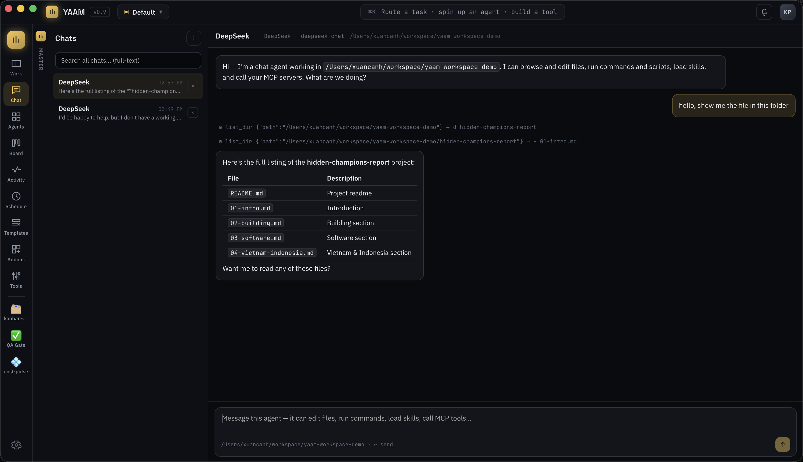
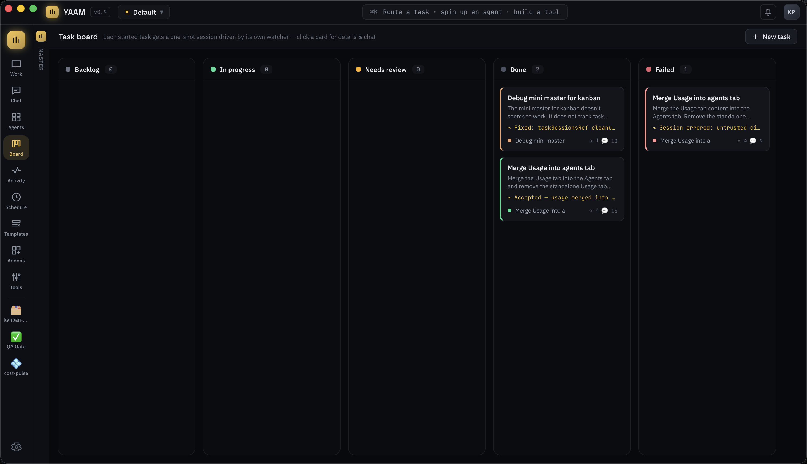
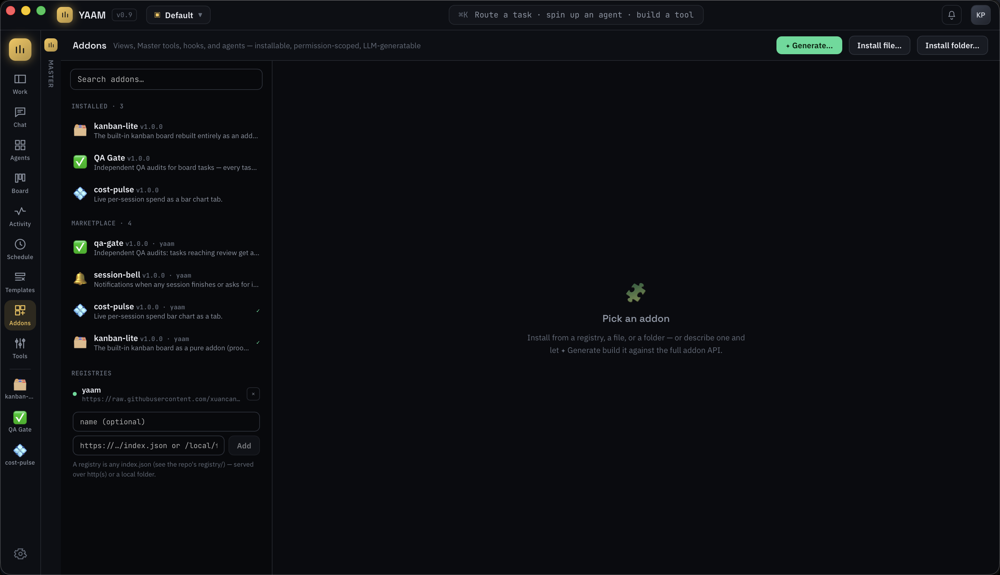

# YAAM — Yet Another Agent Manager

A desktop app for running and orchestrating many live coding-agent sessions at once. YAAM puts a **Master** orchestrator between you and a fleet of real CLI agents (Claude Code, Codex, Gemini CLI, Aider, shells, REPLs) — you talk to Master, and it routes work to sessions, watches them, escalates when they need you, and builds schedules and tools on request.

Built with [Tauri 2](https://tauri.app) + React + TypeScript.


## Highlights

- **Real terminals, not fakes** — every session is an OS process in a PTY, rendered with xterm.js.
- **Remote machines** — run any session on a saved SSH host (optionally detached in tmux; Files/Git browse the remote host too).
- **Master orchestrator** — a Claude-with-tools that routes tasks, monitors sessions, and acts on your chat instructions.
- **Chat agents** — in-app Claude-Desktop-style assistants that edit files, run commands, load skills, and call MCP servers.
- **Worktree isolation + review queue** — sessions and tasks can run in mirrored git worktrees (multi-repo folders supported); review the diff, stage, commit, and merge back from a Fork-style git workbench.
- **Watcher-driven task board** — a kanban where each card is run by its own mini-Master.
- **Extensible via addons** — a real plugin system with a marketplace, sandboxed views, Master tools, hooks, and per-addon agents.
- **Mobile companion** — a paired-device web app served from the desktop: drive tasks, chats, and sessions from your phone over LAN, Tailscale/WireGuard, or a Cloudflare Tunnel; execution never leaves the machine.
- **Workspaces** — isolated sets of sessions, chats, boards, and schedules that keep running in the background.
- **Multi-provider** — Anthropic, OpenAI, DeepSeek, Kimi, Gemini, GLM, AWS Bedrock, and OpenAI-/Anthropic-compatible custom endpoints.

## Sessions — real terminals


- Each session runs a configurable agent CLI, a plain shell (zsh/bash/sh/fish/nu), or a custom command in the working directory you choose.
- Full terminal emulation: prompts, colors, TUIs, keystrokes to the PTY, resize handling. Commands run through a login-shell wrapper so PATH from nvm/Homebrew/Cargo resolves.
- **Persistent split-pane layouts** — a Chrome-style menu arranges 1–4 panes (single, split, three-up, or 2×2); the layout and orientation are saved and restored on restart.
- Per-pane stop/resume/exit-code status, maximize/restore, and rename.
- **Detachable sessions** — start a session in detached mode and its PTY lives in a separate host process with its own lifecycle: it keeps running when YAAM quits, and the app reattaches later (▶) with the recent output replayed. Stop ends it for real; everything else (monitors, remote companion, resize) works as usual.
- **Remote machines** — save SSH hosts in **Settings → Machines** and run any session on one: by default the agent runs on the host over SSH just like a local session (it ends when you disconnect), and checking **Detached** keeps it alive in a **tmux** session across disconnects and app restarts (Resume reattaches, Stop ends it). The **Files and Git** panels operate over SSH on that host, multi-repo folders included. Auth is keys/ssh-agent only (no passwords; a **Test connection** check probes tmux, `base64`, git, and the working dir). A machine can be chosen in the New Session dialog and on templates, board tasks, and schedules.
- **Compact session tabs** — a single color-coded dot carries each session's status (no text label), blinking sky-blue while the agent is streaming a response; focusing a tab clears its notifications.

## Master — orchestration with monitors

Master is a Claude model with tools (enable in Settings → Master Brain; model selectable). It coordinates the whole fleet without ever seeing raw terminal dumps:

- **Per-session monitors** — every session gets its own lightweight monitor LLM that watches settled output, keeps the status card current, flags when input is needed, and escalates short digests to Master only when noteworthy.
- **Acts on your behalf** — tools to launch, message, and stop sessions; create/toggle/delete schedules; add board tasks; and change app settings and tool permissions straight from chat.
- **Proactive** — session exits and failures trigger Master turns (follow mode).
- **Works without a brain** — with the Master Brain off, deterministic heuristics take over: sessions still flag when they need input, task cards still reach a final state (review/failed) on exit, and session cards get a best-effort status digest that flags error-looking output — so the board and fleet never go stale.

### Agents overview


Each session's card is kept current by its monitor — the current **task**, a timestamped **summary**, an **action** strip when something needs you, plus per-session spend, a live `git diff` review, and archive/restore. The **Overview** rail is a fleet ops console: stat tiles (running / needs you / watched tasks / chats / spend), watched-task cards, and live chat cards.

### Mobile companion

Flip **Settings → Remote Control** and YAAM serves a full mobile web app (embedded in the binary — no hosting) from an axum server on your network, styled after the desktop's design language. The phone opens on **Master** (the default tab) — the orchestrator conversation, in step with the desktop sidebar in both directions — plus **Tasks** (the whole board, task details with criteria, the watcher chat, start/retry), **Chat** (searchable conversations, streaming replies, inline Allow/Deny for ask-mode tool calls, and file attachments from the working folder), **Agents** (filterable session cards; the detail view pins TERMINAL / FILES / CHANGES tabs under the top bar with a two-tap Stop control), and an **Inbox** of approvals. The header and bottom tab bar stay put while content scrolls, and navigation is history-backed, so the native back gesture works like an app.

The terminal is the real thing: raw PTY bytes stream from Rust over SSE into the phone's own xterm.js, with touch scrolling and bottom-stick auto-follow. A **⌨ keys popover** at the left of the composer sends Esc, Tab, Shift+Tab, arrows, and Enter straight to the PTY. **Terminal focus is exclusive** — the device viewing a terminal resizes the actual PTY to its screen, so TUIs reflow natively for the phone; the desktop (or another device) steals focus back by interacting. Files and git diffs browse over an rpc bridge answered by the desktop with its normal adapters, path-scoped to session working folders.

Connecting requires two secrets: the URL token in the connect link (persisted across restarts, editable, regenerable, optionally auto-rotated every N hours) **and** a per-device token minted only when you explicitly approve that device's pairing request — suggested names come from the device's real user agent ("Pixel 8 · Chrome"). Paired devices are stored on both ends (revocable chips in Settings) and survive restarts and token rotations. Every action a phone takes is queued as a command that the desktop applies through the same conductor actions as its own buttons — execution, credentials, and file access never leave the machine.

It's tunnel-friendly by design: each network interface gets its own connect link (LAN, **Tailscale**, **WireGuard**) with one-click copy, the app only ever uses relative URLs so it works unchanged behind a **Cloudflare Tunnel** or any HTTPS reverse proxy, and a public-URL override renders the tokened link for your tunnel hostname.

## Chat — a desktop Claude in your workspace



The **Chat** rail is a home for **chat agents**: in-app LLM assistants (no PTY) that act on your machine.

- **Hands-on tools** — browse/search folders (glob + grep), read/write/surgically-edit files, manage files, run shell commands and scripts, research the web (search + fetch + raw HTTP), control macOS apps via AppleScript, drive the kanban board and schedules, save new skills, and call tools on your **MCP servers**. Built-in write/edit operations are canonically scoped to the chat's working folder; Ask mode runs reads automatically and pauses mutations or external actions for Allow once / Always allow / Deny. Tool calls render as live traces.
- **Slash commands** — `/` opens a fuzzy menu of every skill from the chat's sources (plus `/clear`, `/export`); picking one injects the skill deterministically.
- **File import** — drag & drop or attach files: text inlines, PDFs and office documents (docx/xlsx/pptx) are text-extracted, images go to vision-capable models; a Files toggle mounts the same explorer/rich viewer terminal sessions use (real system file icons, images, PDFs, office previews) — every file row has a one-click ＋ attach, and the viewer offers "Add to chat".
- **Durable workspace memory** — agents read shared memory each turn and append facts via a `remember` tool; a Memory editor lets you prune what they've learned.
- **Streaming replies** — token-by-token, with reasoning models' thinking shown in a collapsible block; stop, retry, copy, and a send queue while the agent is busy.
- **Artifacts pane** — when a reply contains substantial HTML or SVG, an artifact chip opens it rendered live in a sandboxed (no-network) side panel.
- **Configurable agent types** — each with its own provider, credentials, and a per-chat model list; an optional persona and chosen skill sources.
- **Full-text search** across every conversation via an embedded tantivy index, rebuilt automatically.
- Conversations persist and auto-title themselves; transcripts render markdown.

## Task board — watcher-driven kanban



Drag-and-drop kanban where **each task is driven by its own watcher LLM** (a per-task mini-Master): it drafts the card and acceptance criteria from a rough idea (or asks questions if it's too vague), spawns and steers one-shot sessions, verifies live state before claiming progress, moves the card across columns (backlog → progress → review → done/failed), and chats with you in the card's own thread — replies stream in live, and when a task finishes the watcher posts a results summary and asks you to review. Deleting a card **archives** it (recoverable from the Archived viewer, the only place offering permanent deletion); every destructive action across the app asks for confirmation first.

## Worktrees & the review queue

Sessions and board tasks can opt into **git worktree isolation**: the working folder — a single repo *or* a plain folder whose subfolders are each their own repo — is mirrored under `~/.yaam/worktrees/<id>` with one worktree and a `yaam/<id>` branch per repo, so agents never touch your checkout until you approve.

- **Review queue** — cards in "Needs review" open a diff of everything the task changed; **Approve & merge** commits outstanding work and `--no-ff` merges each repo back (conflicts abort safely), **Request changes** bounces the task with your feedback as the watcher's next instruction.
- **Git workbench** — one Fork-style component on three surfaces (session pane popup, the agents → Review drawer, the task drawer's Review tab): a staged/unstaged file tree with per-file staging, single-file or continuous all-files diff views, a repo picker for multi-repo folders, and a commit box with AI-drafted messages. The review drawer adds a feedback chatbox that types straight into the session's terminal.
- **Non-git folders review too** — when the reviewed folder has no git repository, the workbench falls back to a full folder tree with the rich file viewer (code, markdown, images, PDF, office), keeping the review actions.
- A task's follow-up sessions re-enter the same worktree, so work-in-progress carries across relaunches.

## Addons — a real plugin system



Addons extend the app without touching core code. A package (`*.yaam.json` or a readable folder format) can carry any mix of:

- **A view** — a tab in the rail, rendered in a sandboxed iframe that receives live app state and can call back over a whitelisted RPC bridge (read state, message/launch sessions, full board-task CRUD, notifications, private storage) — enough to rebuild built-in views entirely.
- **Master tools** — JS handlers registered into Master's tool list.
- **Hooks** — behavior extensions on session exit, needed-input, and Master's prompt.
- **An agent** — the addon's own mini-Master, scoped to its permissions.
- **Permissions** — every package declares capability scopes; each API call is checked against grants you can revoke per-permission. Dangerous scopes stay off until you enable them.

Addons live in a **marketplace** (rail → Addons): search, an installed list with grant chips, packages from any number of registries (http(s) or local folders), and **✦ Generate** — describe an addon and an LLM builds, validates, and installs it. Every addon tab has **Preview**, **Source**, and **Customize** (a scoped chat that edits the addon through a validated tool).

> Addon views, tool handlers, and hooks run in opaque-origin, network-denied
> sandbox frames. Their only app access is the permission-scoped addon API.

## Workspaces

Work is organized into **workspaces** (switcher in the title bar): each has its own sessions, Master chat, schedules, board, activity feed, and notifications. Background workspaces stay alive — sessions keep running and monitors keep reporting; Master events queue and are summarized when you switch in. Settings, agent types, addons, and the tool registry are global.

## More

- **Schedules** — a 5-field cron scheduler plus one-time runs; can launch sessions or seed board tasks, from the UI or Master.
- **Templates** — preconfigured launches, one-shot (run a task and exit) or interactive, that feed quick launches, schedules, and tasks; any of them can target a saved remote machine.
- **MCP everywhere** — streamable-HTTP *and* local stdio servers, a curated one-click marketplace, import from Claude Desktop / Claude Code / Cursor / Codex / Windsurf configs, and `.mcpb`/`.dxt` Claude Desktop extension bundles.
- **Claude plugin marketplaces** — browse repos like `anthropics/claude-plugins-official` and install plugins for chat: skills and commands become slash-invocable skill registries, agents become personas, `.mcp.json` servers register directly, and plugin `hooks/` configs are translated into addon hooks (Stop/SessionEnd → session-exit, Notification → needs-input; runs gated behind the never-auto-granted `exec` permission).
- **Skills** — local instruction packs plus GitHub/local registries (a keychain-backed GitHub token lifts API rate limits).
- **Appearance** — Dark / Midnight / Light / Paper (warm reader-style) / System themes with theme-aware terminal palettes, interface scale, layout density, UI + mono font choices, and markdown-table typography.
- **Notifications & activity** — session exits, failures, cron runs, and Master decisions in the bell popover and Activity timeline, mirrored to the OS notification center when the app is in the background.
- **Persistence** — sessions, board, schedules, templates, layouts, settings, memory, and more survive restarts.

## Development

See [DEVELOPMENT.md](DEVELOPMENT.md) for the contributor workflow and
[docs/architecture.md](docs/architecture.md) for architecture, data flows,
domains, technologies, persistence, and security boundaries. Requires Node 20+,
Rust (rustup), and Xcode command-line tools on macOS.

```sh
cd app
npm install
npm run tauri dev      # run the desktop app with hot reload
npm run tauri build    # produce a distributable bundle
```

## Contributing

Issues and pull requests are welcome. Before opening a PR, run the checks in [DEVELOPMENT.md](DEVELOPMENT.md) (typecheck, lint, and `cargo check`) and keep changes focused.

## License

Released under the [MIT License](LICENSE) — © 2026 xuancanh.
