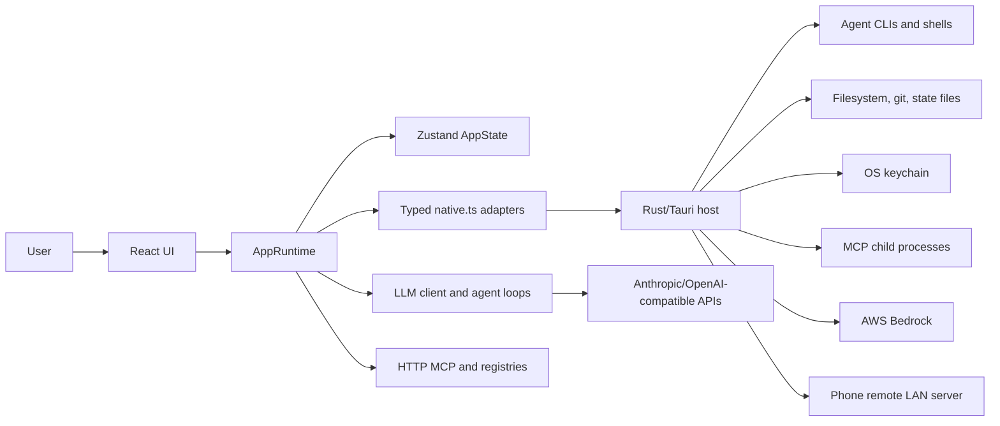
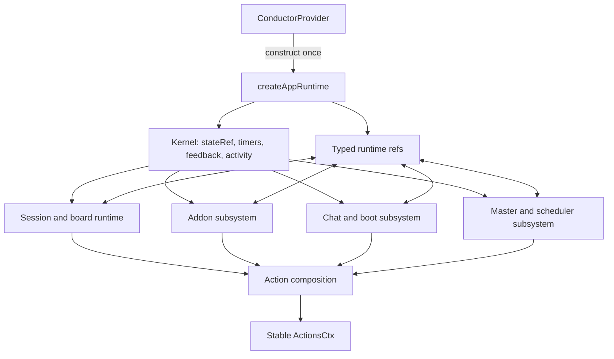
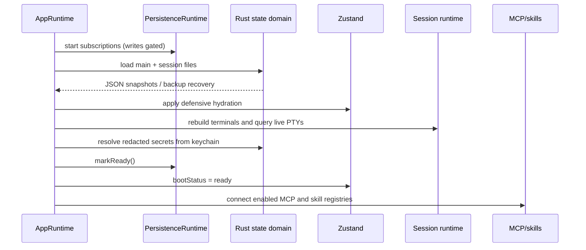
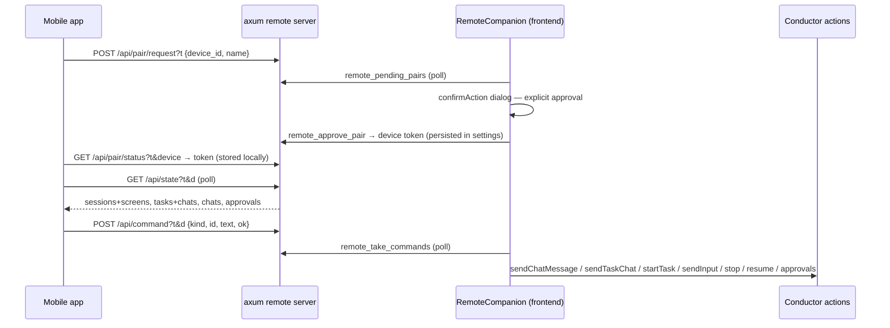

# YAAM system architecture

## Scope and status

This document describes the implementation on 2026-07-05. YAAM is a Tauri 2
desktop application that coordinates live coding-agent CLI processes, in-app
LLM chat agents, task watchers, schedules, MCP servers, and installable addons.

The former monolithic React provider has been replaced by a plain application
runtime. `store.tsx` is now lifecycle glue: it constructs the runtime once,
starts and disposes it, and exposes a stable action surface to React.

## System overview

YAAM has two cooperating processes:

1. The webview frontend owns product state, UI rendering, orchestration logic,
   LLM protocol adapters, and domain runtimes.
2. The Rust host owns privileged OS capabilities: PTYs and child processes,
   filesystem and git operations, state files, the OS keychain, stdio MCP
   processes, chat search, AWS Bedrock invocation, and the phone-remote LAN
   server.

External systems include agent CLIs, LLM provider APIs, HTTP or stdio MCP
servers, addon registries, skill/plugin registries, the local filesystem, and
the OS credential store.



## Repository architecture

```text
app/src/
  app/                    application composition and runtime wiring
    conductor-runtime.ts  createAppRuntime(), lifecycle, shared kernel
    conductor-actions.ts  composes domain action factories
    runtime/               session, addon, chat/boot, master subsystems
    commands/              actor-aware command registry and migrated use cases
  core/                   shared types, store, ports, native bridge, terminals,
                          addon contract, MCP client, skills, static data
  domains/                feature ownership: UI + actions + runtime/domain logic
  infrastructure/
    persistence/          schema, hydration, subscriptions, save runtime
  llm/client.ts           providers, credentials, protocols, SSE streaming
  shared/                 small domain-neutral helpers
  store.tsx               32-line React lifecycle/action provider

app/src-tauri/src/
  lib.rs                  Tauri composition root and command registration
  setup.rs, util.rs       platform setup and shared path helper
  domains/                Rust state + logic + commands + tests by capability
```

Detailed ownership is documented in [Frontend domains](frontend-domains.md) and
[Backend domains](backend-domains.md).

## Frontend runtime composition

`createAppRuntime()` builds a non-React object with `actions`, `start()`, and
`dispose()`. It owns the Zustand mirror, tracked timers, transient toast timer,
activity service, declaration-cycle refs, and four subsystem factories.



The four subsystems are grouped around real runtime cycles:

- Session/board: attention, terminal settle detection, monitors, task watchers,
  launch, task execution, and exit coordination.
- Addon: permission-scoped API, sandboxed handlers/hooks, addon agents,
  customization editor, and package installation.
- Chat/boot: chat histories and cancellation, MCP and skill caches, persistence,
  hydration, terminal reattachment, search indexing, and session teardown.
- Master/scheduler: Master queue and tool loop, proactive event routing, cron
  and scheduled-task execution.

The runtime uses typed mutable cells only for genuine construction cycles, such
as settle events calling monitors while monitors can call Master. Domain state
is not stored in React refs merely for rendering.

`createAppRuntime` also constructs the actor-aware command registry and default
capability policy. Migration is incremental: UI and addon `send_to_session`
calls are registered and active in this snapshot. Addon calls carry the addon
id into policy evaluation and the audit ring. Master, watcher, chat, and other
use cases still largely use their existing domain adapters and policy gates.

## React composition

`App.tsx` renders a persistent shell—title bar, icon rail, Master sidebar,
active main view, overlays, drawer, command palette, and toast. Components read
narrow state slices through `useConductorSelector`; actions come from the stable
`ActionsCtx` through `useActions`.

The Zustand store contains data only. Domain action factories and runtimes live
outside the store. This separation prevents terminal bytes or chat deltas from
rerendering the provider and makes runtime logic testable without React.

## State model

`AppState` is the frontend source of truth. Major categories are:

- Global configuration: settings, provider and agent types, templates, MCP
  servers, skills, personas, registries, addons, and Master tool policy.
- Sessions: one global `agents` array containing real PTY sessions and in-app
  chat sessions, distinguished by `kind` and tagged with `workspaceId`.
- Active workspace data: groups/layout, Master messages, tasks, schedules,
  activity events, notifications, and minimized sessions.
- Inactive workspace data: the same scoped fields stored under
  `workspaceData[workspaceId]`.
- UI state: current view, panels, drawers, palette, composer, toast, and active
  addon/chat.
- Transient boot state: `bootStatus`, never persisted.

Workspace switching atomically stashes the active flat slice and loads the
target slice. Sessions remain global so background PTYs stay alive.

Runtime-only data is deliberately outside `AppState`:

- xterm instances and decoders;
- LLM API histories, busy sets, queues, and abort controllers;
- live MCP sessions and fetched skill catalogs;
- task-to-session fast bindings;
- keychain-ready secret identifiers and persistence timers.

## Boot and persistence flow



Persistence is split into a low-churn main file and one file per session:

```text
<Tauri app-data>/conductor-state.json
<Tauri app-data>/conductor-state.json.bak
<Tauri app-data>/sessions/<session-id>.json
<Tauri app-data>/sessions/<session-id>.json.bak
```

Frontend subscriptions debounce main and per-session writes independently.
Session additions/removals are written immediately. Rust writes through a
unique temporary file, `fsync`, backup rotation, and rename; Unix files are
created with mode `0600`.

Tauri vetoes an OS close and emits `close-requested`. The frontend awaits a
bounded persistence flush, then destroys the window. Browser preview uses
localStorage and a best-effort `beforeunload` flush.

## Terminal session data flow

```mermaid
sequenceDiagram
  participant Caller as UI/Master/Board/Scheduler
  participant SR as Session runtime
  participant Rust as Rust SessionManager
  participant CLI as CLI process in PTY
  participant XT as xterm registry
  participant Mon as Monitor/Watcher

  Caller->>SR: launchSession(command, cwd, options)
  SR->>SR: build launch plan and optimistic Agent
  SR->>Rust: spawn_session
  Rust->>CLI: portable-pty spawn
  CLI-->>Rust: raw PTY bytes
  Rust-->>XT: session-data event (base64 payload)
  XT->>XT: render bytes and decode complete plain lines
  XT->>SR: line + raw activity callbacks
  SR->>SR: update bounded log/usage; reset settle timer
  SR->>Mon: stable screen after quiet period
  Mon-->>Caller: status, attention, prompt, or Master digest
```

The xterm registry is module-level so terminals survive pane remounts. Live PTY
scrollback is never replayed into the process; reattached TUIs are repainted with
a two-step resize. Text and Enter are written separately because interactive
agent TUIs can interpret a combined write as a paste.

Rust uses a generation number per session id so an old exit-reaper cannot remove
or emit an exit for a newly resumed process. Reusing a live id kills the old
child before replacing its handle. On Unix, stop/replacement first sends SIGTERM
to the child and process group, then forces SIGKILL after a two-second grace
period so CLIs can flush resume data.

## Settle, prompt, monitor, and watcher flow

Raw PTY activity resets a three-second quiet timer. On settle, YAAM examines the
rendered alternate screen for TUIs or new plain-output lines otherwise. It
detects prompt/dialog patterns, extracts numbered options, and deduplicates
repeat detections.

An armed response watch compares the stable output with the screen snapshot at
send time. If content changed and the session is not actively viewed, it marks
attention and notifies. A four-second TUI scan is an additional safety net for
full-screen approval dialogs.

Per-session monitor LLMs keep capped private histories. They can update status,
flag input, and send a short digest to Master. Task-bound sessions are instead
owned by per-task watchers, which may inspect output, update the card, ask the
user, send input, or spawn up to three workers.

## Master orchestration flow

Master receives the current structured state and user/queued event history. Its
tool loop is capped at ten rounds. Each tool call is executed through a
`MasterExec` adapter over session, board, schedule, addon, and state operations.

Two policy layers apply:

- Global tool catalog: Auto, Ask first, Approval, or Off.
- Per-session tool settings for session-specific actions.

Ask-first approval is a one-shot token consumed by the retry. The integrity
check retries a final answer that claims an action without any action tool call.
Proactive events for inactive workspaces are queued and summarized after the
user switches to that workspace.

## In-app chat flow

Chat sessions do not use PTYs. A provider-neutral streaming LLM loop combines:

- local file/navigation/edit/exec tools;
- web and raw HTTP tools;
- board, schedule, and skill tools;
- tools discovered from enabled MCP sessions;
- local and registry skills;
- an optional persona and attachments.

The loop supports 24 tool rounds, streams answer and thinking channels
separately, refuses truncated tool arguments, and caps private history. Chat
runtime state is keyed by chat id and cancellable through `AbortRegistry`.
Risky built-ins (`run_command`, `run_applescript`, `delete_path`) pause for an
inline approval in the default Ask mode; Auto mode bypasses that prompt.
Replies containing substantial HTML or SVG surface an artifact chip that opens
the content in a sandboxed, network-denied side panel (the same iframe
hardening the addon sandbox uses).

Visible transcripts are persisted. Tool and thinking messages are excluded
when reconstructing provider history after restart. Chat transcript changes
debounce a full rebuild of the in-memory Tantivy search index.

## Board and schedule flow

Board tasks carry a specification, acceptance criteria, column, optional
template/agent/cwd, schedule time, task chat, watcher state, and attached session
ids. Starting a task prefers its watcher when an LLM is configured; the watcher
calls the canonical task-session launch path. A deterministic direct launch is
the fallback.

All task launches—active or background workspace—use the same one-shot path.
The scheduler ticks every 15 seconds after boot and handles:

- recurring five-field cron entries;
- one-time timestamps;
- schedules that add board tasks;
- template schedules that queue immediate board tasks;
- raw command schedules;
- board tasks with `scheduleAt`.

One-time entries are disarmed and recurring entries deduplicate by minute.

Watcher replies stream into the task chat while they are generated: the
watcher's tool loop runs over the streaming transport, throttled deltas land
in a transient `taskStreams` store map, and the task drawer renders a live
bubble until the turn settles and the final message is posted.

Deleting a task archives it (recoverable); permanent deletion exists only in
the board's Archived viewer, and all destructive actions confirm first.

## Worktree isolation and review flow

Sessions and tasks can opt into git-worktree isolation at launch. The Rust
worktree domain mirrors the working folder — one repo, or a folder of repos —
under `~/.yaam/worktrees/<slug>` (branch `yaam/<slug>` per repo, loose entries
symlinked), and the session runs in the mirror's `workdir`. The agent record
carries `{ root, base, workdir }`; a task's follow-up sessions re-enter the
same mirror so work-in-progress survives relaunches.

Review closes the loop: worktree diffs (against each repo's fork ref, new
files included) render in the review surfaces — the board's ReviewPanel, the
agents → Review drawer, and the shared `GitWorkbench` (staging, per-side
diffs, commits with AI-draftable messages, multi-repo picker). Approve stages
and commits outstanding work, `--no-ff` merges each repo back into the
original checkout (conflicts abort per repo and are reported instead of
leaving the source mid-merge), removes the mirror, and completes the
task/session; request-changes routes reviewer feedback to the watcher (tasks)
or straight into the PTY (sessions).

When the reviewed folder contains no git repository at all, the workbench does
not dead-end: it falls back to a standalone folder explorer — the same tree +
rich file viewer (code, markdown, images, PDF, office) the terminal/chat file
pane uses — while keeping the host-supplied review actions.

## Mobile companion flow

An opt-in companion (Settings → Phone remote) serves a full mobile web app for
tasks, chats, and sessions. The Rust `remote` domain runs an **axum** server
(default port 8712) that embeds the single-file mobile bundle
(`npm run build:mobile` → Vite + `vite-plugin-singlefile` →
`remote-app.html`, `include_str!`-ed into the binary) plus a JSON API.

Access needs two secrets: the per-start URL token (possession of the connect
link) AND a per-device token minted only by an explicit pairing approval on
the desktop. Paired devices persist in `settings.remoteDevices` (revocable in
Settings) and are re-hydrated into the server on every start; the phone keeps
its token in localStorage.



The server never executes anything and holds no credentials — it stores the
latest published snapshot string and a command queue. The desktop
`RemoteCompanion` builds capped snapshots from `AppState` (sessions with
terminal tails, the full board with watcher chats, chat transcripts,
approvals) and applies drained commands through the same conductor actions the
desktop buttons use, so a paired phone can never do anything the UI cannot.

Network reach: connect URLs are enumerated per interface and classified (LAN,
Tailscale CGNAT, WireGuard, VPN), and the mobile app uses relative API paths
only, so it works unchanged behind a Cloudflare Tunnel or any HTTPS reverse
proxy; Settings offers a public-URL override for tunnel hostnames.

## Addon flow

Addon packages can contribute a view, Master tools, lifecycle hooks, and a
permission-scoped addon agent. Package parsing normalizes JSON or the folder
manifest format and validates the declared surface.

Views run in opaque-origin `sandbox="allow-scripts"` iframes with a restrictive
CSP and postMessage RPC. Tool and hook JavaScript runs in a separate hidden
opaque-origin iframe, not in the privileged main webview. Host RPC validates the
method whitelist, applies the permission-wrapped `AddonApi`, caps returned data,
and terminates timed-out handlers.

See [Addon architecture](addons.md) and [Security model](security.md).

## LLM provider layer

`llm/client.ts` normalizes two wire protocols:

- Anthropic Messages, including Bedrock-compatible bodies.
- OpenAI-compatible chat completions.

Declared providers are Anthropic, OpenAI, DeepSeek, Kimi, Gemini's OpenAI
compatibility endpoint, GLM, AWS Bedrock, and custom OpenAI-/Anthropic-compatible
endpoints. Streaming parsers normalize text, thinking, tool calls, stop reason,
and truncated argument state.

Credentials may come from a static key, an expiring credential command, or the
AWS credential chain. Bedrock calls are delegated to Rust for AWS SDK signing
and refresh.

## Technology stack

| Area | Implementation |
| --- | --- |
| Desktop shell | Tauri 2.11, native dialogs, HTTP and log plugins |
| Frontend | React 19, TypeScript 6, Vite 8 |
| State | Zustand 5 plus `useSyncExternalStore` selector hooks |
| Terminal | xterm.js 6, FitAddon, Rust `portable-pty` 0.9 |
| Backend | Rust 2021, minimum Rust 1.77.2 |
| LLM | Anthropic Messages, OpenAI-compatible APIs, AWS Bedrock SDK |
| Search | Tantivy 0.22 in-memory index |
| Secrets | `keyring` 3.6 using OS-native credential stores |
| Testing | Vitest 4, Testing Library, Rust unit tests |
| Static analysis | TypeScript compiler, oxlint, Cargo check/test |
| Styling | CSS variables and inline style objects; no CSS framework |

## Security and operating assumptions

The main webview and Rust host are trusted application code and run with the
user's OS permissions. Agent CLIs, configured commands, stdio MCP servers, and
Auto-mode chat tools can therefore perform user-level actions. YAAM provides
policy and isolation around selected entry points; it is not an OS sandbox for
the whole application.

The complete trust model, mitigations, and current limitations are in
[Security model](security.md).

## Testing topology

Frontend tests cover pure state transitions, runtime lifecycle and cancellation,
session launch/exit/prompt behavior, scheduler due logic, persistence detection
and close flushing, addon sandbox RPC, search indexing triggers, settings
imports, selectors, and action stability. Rust tests live beside each domain and
cover filesystem scope, process execution, atomic persistence, session launch
and id detection, MCP stdio, search, git parsing, Bedrock credentials, and shared
path expansion.

The verification gate is documented in [DEVELOPMENT.md](../DEVELOPMENT.md).
