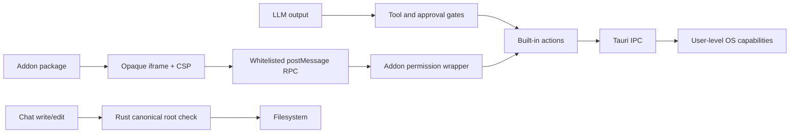

# YAAM security model

## Scope

YAAM is a local desktop orchestration tool, not a multi-tenant service. It runs
agent CLIs, commands, MCP servers, and LLM-selected tools with the current OS
user's authority. Its security controls reduce accidental or package-driven
authority and protect selected boundaries; they do not turn arbitrary user
commands into sandboxed operating-system processes.

## Trust zones

| Zone | Trust level | Examples |
| --- | --- | --- |
| Rust host and shipped frontend | Trusted application code | Tauri commands, AppRuntime, built-in actions |
| User configuration | Explicitly trusted capability | CLI commands, credential/refresh commands, MCP binaries, Auto mode |
| LLM output | Untrusted instructions/data | Master tools, chat tools, monitors, watchers, addon agents |
| Agent/MCP output | Untrusted content from trusted processes | Terminal screens, JSON-RPC tool results, command output |
| Addon package JavaScript/HTML | Untrusted code | Views, Master tool handlers, hooks |
| Remote registries/web content | Untrusted external data | Addon manifests, skills, plugins, fetched pages |
| Persisted local state | User-private but not encrypted | Main JSON, per-session JSON, output/chat history |

## Primary security boundaries

The main webview is a trusted boundary. Once a request reaches a registered
Rust command, most commands assume the caller is trusted and validate their
specific inputs rather than an actor identity.

## Addon isolation and authorization

### Views

Addon views run in iframes with `sandbox="allow-scripts"` and no
`allow-same-origin`, producing an opaque origin. The injected CSP denies all
default network access and permits only inline script/style plus data/blob
images and data fonts. The view cannot inherit the app origin, Tauri globals,
DOM, storage, or network authority.

The host accepts messages only when `event.source` is the installed addon's
iframe window. Calls use a fixed method whitelist and correlated result ids.
State snapshots are sent only when the addon is enabled and holds `state:read`.

### Tool handlers and hooks

Handler/hook source is evaluated inside a separate hidden iframe with the same
opaque-origin/no-network design. It receives only:

- an input/event value;
- an immutable bounded state snapshot when permitted;
- async API stubs that post messages to the host.

The host revalidates the method, invokes a permission-wrapped `AddonApi`, caps
JSON-serializable API results at 256 KiB, and terminates/reset the frame after a
10-second timeout. JavaScript is never evaluated in the main webview.

### Permissions

Addon scopes are:

- `state:read`;
- `sessions:send`;
- `sessions:launch`;
- `tasks`;
- `schedules`;
- `agent`;
- `master:prompt`;
- `ui`;
- `storage`.

Every API method maps to exactly one scope. Disabled addons receive no grants.
Fresh installs do not auto-grant the machine-acting or LLM-steering scopes:
session send/launch, tasks, schedules, addon agent, and Master prompt changes.
Upgrades preserve only grants still requested by the new package.

Addon storage is namespaced by addon id and values are capped at 256 KiB.

## LLM action controls

### Master

Master has a global tool catalog with four states:

- Auto — execute without another prompt;
- Ask first — surface an approval and consume one approval on retry;
- Approval — block until the user changes policy;
- Off — disabled.

Session-targeted operations also inspect the selected session's own tool
settings. The tool harness returns blocked decisions to the model rather than
performing the side effect. An integrity retry catches final prose that claims
an action without an action tool call.

### Chat agents

Chat sessions default to Ask mode. The following built-ins create an inline
approval bubble before execution:

- `run_command`;
- `run_applescript`;
- `delete_path`.

Approval promises are resolved by the user and cancelled if the chat is stopped
or deleted. Auto mode deliberately bypasses these prompts. Truncated streaming
tool arguments are never executed.

### Monitors, watchers, and addon agents

Monitor tools are limited to status, input escalation, and Master reporting.
Watcher tools are scoped to one task and its sessions. Addon-agent tools are the
same permission-wrapped `AddonApi` exposed to the package.

### Application command policy

`app/commands/` implements an actor-aware command registry with validation,
capabilities, allow/ask/deny policy, bounded audit history, and one-shot
approvals. `AppRuntime` constructs it; UI `send_to_session` calls execute as the
user actor, while addon calls execute as an addon actor carrying the package id.
The default policy derives addon capabilities from the enabled addon's grants.

Migration is incomplete: Master, watcher, chat, and most addon operations have
not been moved through registered commands. The registry is therefore an active
but partial boundary, not yet the single authorization or audit path for every
actor.

## Filesystem controls

### Canonically rooted operations

Rust filesystem commands accept an optional workspace root. With a root they
canonicalize the root and target's nearest existing ancestor, resolve symlinks,
reject traversal/non-root targets, and perform the operation immediately after
the check.

Chat `write_file` and `edit_file` pass the chat cwd as this authoritative root.
The frontend also performs a lexical check for fast, readable errors, but the
Rust check is the security boundary. Tests cover file/directory symlink escapes,
absolute escape, `..`, new files, and missing roots.

### Trusted/unscoped operations

When no root is supplied, filesystem commands operate on the requested user
path. This supports native file pickers, the file pane, skill/plugin import,
attachments, and intentional reads outside a chat cwd.

Chat reads may use absolute paths by design. `exec_command` accepts arbitrary
shell commands and cwd. It limits time and output but is not a filesystem or
network sandbox.

### File-management operations

Chat `create_dir`, `move_path`, `copy_path`, and `delete_path` use dedicated Rust
commands that authorize destinations against the canonical workspace root.
Moves authorize both paths, deletion refuses the root itself, and recursive
copies reject symlinks. `delete_path` remains approval-gated in Ask mode.

## Process execution

### PTY sessions

Agent CLIs and shells are user-selected programs. Command sessions run through
`/bin/sh -lc`; terminal sessions start the selected executable directly. They
inherit user-level OS authority. YAAM manages lifecycle and terminal I/O but
does not sandbox their filesystem, network, or subprocess access.

On Unix, normal stop sends SIGTERM to the child and process group, followed by
SIGKILL after a two-second grace period. This is lifecycle hygiene and resume
file protection, not privilege isolation.

Detached sessions deliberately escape the app's lifecycle: the host process
runs in its own session/process group (`setsid`) with the user's full
authority and keeps running after YAAM quits. Its unix socket
(`~/.yaam/detached/<id>.sock`) accepts any local process with filesystem
access to it — the boundary is the user account, same as the PTY itself.
Stopping a detached session from the app SIGTERMs the host's process group.

### One-shot execution

Chat/utility commands run in a separate process group on Unix, with null stdin,
timeout capped at five minutes, process-group kill on timeout, and 40 KiB output
cap. These are availability controls, not privilege reduction.

### MCP servers

Configured stdio MCP servers are local executables with supplied args, cwd, and
environment. They run with user authority and can implement arbitrary tools.
MCP tool calls are not part of the chat built-in Ask-mode list. Installing or
enabling an MCP server therefore establishes trust in that server and its tool
implementation.

## Network model

The Tauri HTTP plugin capability permits:

- any HTTPS destination;
- HTTP on `localhost` or `127.0.0.1`.

It is used for LLM APIs, HTTP MCP, registries, web search/fetch, and raw chat
HTTP tools. Remote HTTP responses are untrusted and may influence an LLM.

There is no per-domain host allowlist, response content sanitizer beyond the
specific parsers/caps, or localhost SSRF confirmation. Auto-mode agents and MCP
tools can make network requests allowed by their implementation.

Addon frames do not inherit this HTTP capability because they have an opaque
origin, a network-denying CSP, and only the host RPC surface.

### Mobile companion server

The opt-in mobile companion (Settings → Remote Control) is the one place YAAM
*listens* on the network: a Rust axum server on `0.0.0.0:8712`. Its exposure
is deliberately layered:

- **Two secrets per request.** State/command routes require the per-start
  24-character URL token AND a 32-character per-device token. Device tokens
  are minted only by `remote_approve_pair` — an explicit confirmation dialog
  the user answers on the desktop. Possessing the connect link alone gets a
  device only as far as requesting a pairing (pending list capped at 5,
  device ids validated and deduped).
- **Revocable on both ends.** Paired devices persist in settings and render
  as revocable chips; the frontend re-hydrates the server's device set on
  every start and settings change, so a revoke locks the device out
  immediately. The phone stores its token in localStorage.
- **Command queue, not execution.** The server executes nothing and holds no
  credentials — it stores the frontend-published snapshot and a queue of
  `{ kind, id, text, ok }` commands. The frontend applies each through the
  same gated conductor actions as the desktop buttons (chat send, task
  chat/start, session input/stop/resume, approvals), so a paired phone's
  authority is exactly the desktop UI's.

Paired phones CAN type into live session terminals, message chat agents,
stream raw terminal output, and browse files/diffs under live session working
folders (rpc requests are path-scoped on the desktop before answering) —
pairing a device is trusting its holder with those capabilities; approve
requests only for devices you recognize. The URL token persists across
restarts by default (Settings offers regenerate + auto-rotate); device tokens
are only ever minted through the explicit pairing dialog.

Residual risk: the built-in transport is plain HTTP, so on an untrusted LAN
the tokens and snapshot (session names, terminal tails, task/chat content)
are sniffable. Tailscale/WireGuard interfaces get their own connect URLs and
encrypt in transit; a Cloudflare Tunnel (public-URL override; the app uses
only relative paths) terminates TLS at the edge. The feature is off by
default.

## Secret handling

Credential-bearing fields include the Master API key, chat-agent keys, and MCP
headers. The persistence runtime mirrors them to the OS keychain under service
`dev.yaam.conductor`.

Only accounts confirmed written to the keychain are redacted from the main JSON
file. If keychain storage fails, YAAM intentionally keeps the value in plaintext
state to avoid silent credential loss and logs the failure. Browser preview has
no keychain and stores state in localStorage.

Secrets exist in frontend memory while in use. Credential commands and AWS
refresh commands are arbitrary user-configured shell commands. Bedrock signing
and AWS credential-chain handling occur in Rust.

Persistence files use `0600` on Unix and atomic backup writes, but they are not
encrypted. Terminal output, chat transcripts, task chat, prompts, and tool traces
may contain sensitive data and are persisted unless excluded by their schema.

## Persistence integrity and availability

- Partition/session names reject separators and traversal.
- Writes use unique temp files, fsync, backup rotation, and rename.
- Frontend writes serialize per partition to avoid temp/rename races.
- Main hydration can recover backup; session loader can recover orphaned
  backups.
- Writes are disabled until hydration applies the restored snapshot.
- OS close waits up to three seconds for a final flush.
- Session logs, UI histories, addon storage values, command results, search
  messages, and sandbox results have explicit bounds.

These controls protect against crashes and accidental corruption, not malicious
local file modification. Persisted JSON is parsed and defensively hydrated but
is not signed.

## Main webview and IPC boundary

The Tauri application-level CSP is currently `null`. The shipped main webview is
trusted and has access to registered commands and approved plugins. A script
injection vulnerability in first-party UI code would therefore be high impact.
Avoid unsafe HTML in the main origin and keep untrusted content in sandboxed
frames or escaped React rendering.

Rust commands do not receive the frontend actor identity and generally do not
enforce Master/chat/addon policy. Those checks occur before IPC. Addon isolation
is stronger because package code cannot reach IPC directly; it can only request
host RPC.

## Prompt injection and untrusted model context

Terminal screens, web pages, files, MCP results, addon snapshots, and registry
skills can contain instructions that an LLM may follow. System prompts tell
agents to ground claims and use scoped tools, but prompt text is not a hard
security boundary.

Effective controls are the executable boundaries:

- Master catalog/session policy;
- chat Ask mode and canonical write root;
- addon permission wrapper and iframe isolation;
- bounded/cancellable runtimes;
- Rust path/name validation.

Users should review third-party skills, MCP servers, addons, and Auto-mode
requests as executable trust decisions.

## Security change checklist

- New Tauri command: define caller/trust assumptions, validate paths/names and
  sizes in Rust, register it in `lib.rs`, and add a typed native adapter.
- New chat tool: classify whether it needs Ask-mode approval, root enforcement,
  timeout/output bounds, and cancellation.
- New addon API method: update the API type, method-permission map, whitelist,
  raw implementation, sandbox tests, and addon documentation.
- New persisted secret: add keychain account mapping, redaction, hydration, and
  failure behavior tests.
- New remote registry/content type: cap size, validate schema, avoid evaluating
  content in the main webview, and document trust implications.
- New MCP capability: decide how server-initiated requests, roots, and user
  approvals are handled before enabling it.
